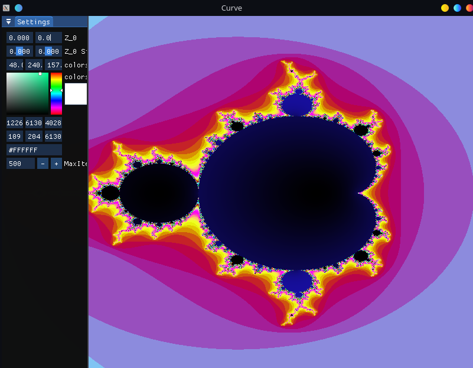
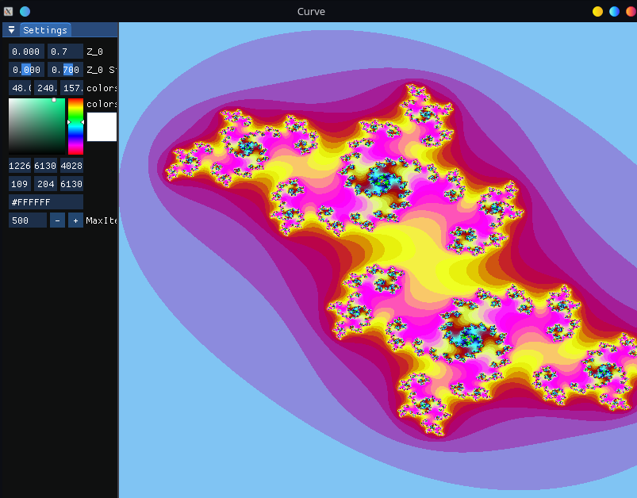

# CWindow 
## About
CWindow is cross-platform multi renderer lib for creating simple meshes, shaders, and computing on GPU.
It unify multiple renderers to simple most often used operations like, binding shaders, rendering mashes,
swapping window etc. Good to use in simple project or just learning shaders and rendering.


## Screenshots

<table>
  <tr>
    <td align="center">
      <a href="docs/malgenbrota.png">
        <br>
      </a>
    </td>
    <td align="center">
      <a href="docs/docs/Julia.png">
        <br>
      </a>
    </td>
  </tr>
</table>


## Table of Contents
- [About](#about)
- [Screenshots](#screenshots)
- [Table of Contents](#table-of-contents)
- [Installation](#installation)
  - [1. clone repo with submodules](#1-clone-repo-with-submodules)
  - [2. init and update submodules (if not cloned with --recursive flag)](#2-init-and-update-submodules-if-not-cloned-with---recursive-flag)
  - [3 Add CWindow to your cmake project](#3-add-cwindow-to-your-cmake-project)
  - [4.1 compile via cmake](#41-compile-via-cmake)
  - [4.2 compile via cmake with parameters for platform and renderer](#42-compile-via-cmake-with-parameters-for-platform-and-renderer)
  - [5 Run your executable](#5-run-your-executable)
- [Configurations flags](#configurations-flags)
  - [Platforms](#platforms)
  - [Renderers](#renderers)
  - [Default and Detection](#default-and-detection)
- [Gui Usage](#gui-usage)
  - [Initialization](#initialization)
  - [Workspace](#workspace)
  - [Adding Window](#adding-window)
  - [Full Example of Usage](#full-example-of-usage)
- [Renderer Usage](#renderer-usage)
  - [Info](#info-2)
  - [Editing Window](#editing-window)
  - [Window loop](#window-loop)
  - [Getting window ref](#getting-window-ref)
- [WindowData](#windowdata)
  - [Info](#info-3)
  - [Data Access](#data-access)
- [InputData](#inputdata)
  - [Info](#info-4)
  - [Data Access](#data-access-1)
- [Uniform](#uniform)
  - [Info](#info-5)
  - [Usage](#usage)
  - [Supported Types](#supported-types)
  - [Memory Management](#memory-management)
- [DrawShader](#drawshader)
  - [Info](#info-6)
  - [Usage](#usage-1)
  - [Hot-Reloading](#hot-reloading)
  - [Memory Management](#memory-management-1)
  - [Example](#example)
- [Mesh](#mesh)
  - [Info](#info-7)
  - [Storing Data](#storing-data)
  - [Mesh control and functions](#mesh-control-and-functions)
  - [Render Example](#render-example)
  - [Also check](#also-check)
- [ComputeShader](#computeshader)
  - [Info](#info-8)
  - [Basic Usage](#basic-usage)
  - [Data Processing Example](#data-processing-example)
  - [Available Functions](#available-functions)
- [FreeCamera3D](#freecamera3d)
  - [Info](#info-9)
  - [Camera control and functions](#camera-control-and-functions)
  - [Code Example](#code-example)
  - [Also check](#also-check-1)
- [Implemented optimizations](#implemented-optimizations)
- [Full Example](#full-example)
- [Features](#features)
- [Libraries](#libraries)
- [License](#license)
- [Prerequisites](#prerequisites)
- [Other projects that use it](#other-projects-that-use-it)


## Installation
### 1. clone repo with submodules
```bash
  git clone --recursive https://github.com/Daynlight/CWindow.git
```
### 2. init and update submodules (if not cloned with --recursive flag)
```bash
  git submodule init
  git submodule update
```
### 3 Add CWindow to your cmake project
```cmake
  cmake_minimum_required(VERSION 3.15)

  project(Example LANGUAGES CXX C)

  add_subdirectory(CWindow/CWindow)

  set(src "Main.cpp")
  set(headers "Mandelbrot.h")

  add_executable(Example ${src})
  target_link_libraries(Example CWindow)
```
### 4.1 compile via cmake
```bash
  mkdir build/
  cd build/
  cmake ..
```
### 4.2 compile via cmake with parameters for platform and renderer
```bash
  mkdir build/
  cd build/
  cmake .. -DRENDERER="DIRECTX" -DPLATFORM="WIN32"
```
### 5 Run your executable
```bash
  ./Example.exe
```


## Configurations flags
### Platforms
1. WIN32 - windows platform
2. UNIX - linux platform

### Renderers
1. OPENGL - OpenGL (glad 4.3, glfw cross-platform)
<!-- 2. DIRECTX - directx 12 (windows only)
3. VULKAN - vulkan renderer (cross-platform) -->

### Default and Detection
1. Platform is detected in cmake
2. Default renderer is OpenGL


## Gui Usage
### Initialization
1. Initialize renderer and window
2. Initialize gui. Here you can provide custom gui style with ImGuiIo parameter

### Workspace
#### Info
You can provide workspace
You have to provide ```std::function<void()> render_windows``` that specify place where window will be render

#### Example Workspace
```cpp
gui->setWorkspace([](std::function<void()> render_windows){
  const ImGuiViewport* viewport = ImGui::GetMainViewport();
  ImGui::SetNextWindowPos(viewport->WorkPos);
  ImGui::SetNextWindowSize(viewport->WorkSize);

  render_windows();
});
```

### Adding Window
#### Info
1. You need to specify unique name for renderer window. It is used for fast look up
2. If you want update it you need add window with same name
3. You can provide custom destruction function as second param

#### Example Window
```cpp
gui->addWindow("Example", {[](CW::Renderer::iRenderer *renderer){
  ImGui::Begin("Example", nullptr);
  ImGui::Text("Hello Gui");
  ImGui::End();
}});
```

### Full Example of Usage
```cpp
#include "Renderer.h"
#include "Gui.h"

int main(){
  // init renderer
  CW::Renderer::Renderer renderer;
  renderer.createWindow();
  renderer.createRenderer();
  
  // init gui and add Settings Window
  CW::Gui::Gui gui(&renderer);
  gui.addWindow("Example", {[](CW::Renderer::iRenderer *renderer){
    ImGui::Begin("Example", nullptr);
    ImGui::Text("Hello Gui");
    ImGui::End();
  }});
  
  // main loop
  while(renderer.getWindowData()->should_close){
    gui.render();
    renderer.windowEvents();
    renderer.swapBuffer();
  };
  
  return 0;
}
```


## Renderer Usage
### Info 
1. Platform is detected automatically.
2. When Renderer is initialized, auto window creation and renderer setup occur.
3. On creation, you can pass `true` for a windowless renderer.

### Editing Window
You can edit the window properties using the following functions:

```cpp
// Set window mode (e.g., fullscreen, windowed)
renderer.setWindowMode(CW::Renderer::WindowMode::FULLSCREEN);

// Set window title
renderer.setWindowTitle("My Application Title");

// Enable or disable vertical sync
renderer.setVsync(true);

// Minimize or maximize the window
renderer.minimizedSwitch();
renderer.maximizeSwitch();
```

### Window loop
The main loop of your application should include the following steps:

```cpp
// Start a new frame
renderer.beginFrame();   

// Handle window events (input, resizing, etc.)
renderer.windowEvents(); 

// Swap the buffers to display the rendered frame
renderer.swapBuffer();  
```

### Getting window ref
You can get a reference to Renderer window
```cpp
APIWindow* windowRef = renderer.getWindow(); // where APIWindow is your Renderer Window
```


## WindowData
### Info
You can access InputData by ```renderer->getWindowData()```

### Data Access
* should_close
* vsync
* window_mode
* title
* is_focused
* is_minimize
* is_maximize
* delta_time


## InputData
### Info
You can access InputData by ```renderer->getInputData()```

### Data Access
* mouse_x;
* mouse_y;
* scroll_x;
* scroll_y;
* scroll_is_down;
* left_mouse_button_is_down;
* right_mouse_button_is_down;


## Uniform
### Info
1. Uniform stores shader variables that can be modified from CPU
2. Variables are automatically bound to shader when shader is bound
3. Uniform compiles automatically when used first time
4. Can store multiple types of data (int, float, double, vec2, vec3, dvec2, dvec3)

### Usage
#### Creating Uniform
```cpp
CW::Renderer::Uniform uniform;
```

#### Setting Values
```cpp
// Using operator[] and set<T>
uniform["variableName"]->set<float>(1.0f);
uniform["position"]->set<glm::vec2>({x, y});
uniform["color"]->set<glm::vec3>({r, g, b});
```

#### Getting Values
```cpp
// Using operator[] and get<T>
float value = uniform["variableName"]->get<float>();
glm::vec2 position = uniform["position"]->get<glm::vec2>();
glm::vec3 color = uniform["color"]->get<glm::vec3>();
```

### Supported Types
- `int`
- `float`
- `double` 
- `glm::vec2` (2D vector)
- `glm::vec3` (3D vector)
- `glm::dvec2` (2D double vector)
- `glm::dvec3` (3D double vector)

### Memory Management
* `compile()` - Manually compile uniform buffer (called automatically when needed)
* `destroy()` - Free uniform buffer resources


## DrawShader
### Info
1. DrawShader combines vertex and fragment shaders for rendering
2. Automatically compiles when first used via `bind()`
3. Supports multiple uniform bindings
4. Provides shader hot-reloading via `setVertexShader()` and `setFragmentShader()`

### Usage
#### Creating DrawShader
```cpp
// Initialize with vertex and fragment shader sources
CW::Renderer::DrawShader shader(vertexSource, fragmentSource);
```

#### Binding Uniforms
```cpp
// Create uniform and add to shader
CW::Renderer::Uniform uniform;
shader.getUniforms().emplace_back(&uniform);

// Set uniform values
uniform["position"]->set<glm::vec2>({0.0f, 0.0f});
```

#### Rendering
```cpp
// Basic render cycle
shader.bind();      // Automatically compiles and binds uniforms
mesh.render();      // Render associated mesh
shader.unbind();    // Unbind shader
```

### Hot-Reloading
```cpp
// Update shaders at runtime
shader.setVertexShader(newVertexSource);    // Update vertex shader
shader.setFragmentShader(newFragmentSource); // Update fragment shader
// Next bind() will recompile automatically
```

### Memory Management
* `compile()` - Manually compile shader (called automatically by bind)
* `destroy()` - Free shader resources
* `bind()` - Activate shader and bind uniforms
* `unbind()` - Deactivate shader

### Example
```cpp
// Create shader with sources
CW::Renderer::DrawShader shader(
    R"(
        #version 430
        layout(location = 0) in vec3 aPos;
        void main() {
            gl_Position = vec4(aPos, 1.0);
        }
    )",
    R"(
        #version 430
        uniform vec3 color;
        out vec4 FragColor;
        void main() {
            FragColor = vec4(color, 1.0);
        }
    )"
);

// Add uniform
CW::Renderer::Uniform uniform;
uniform["color"]->set<glm::vec3>({1.0f, 0.0f, 0.0f});
shader.getUniforms().emplace_back(&uniform);

// Render cycle
shader.bind();
mesh.render();
shader.unbind();
```


## Mesh
### Info
1. Mesh moves data from vectors to own registers.
2. Mesh automatically generate buffer and set locations(```layouts```) on gpu.
3. We prefer using ```addVertices()``` for generating culling box.
4. You can pass any other data to gpu via ```setData<T>()```.

### Storing Data 
1. vertices via ```addVertices()```
2. indices via ```addIndices()```
3. any other data via ```setData<T>()```

### Mesh control and functions
* ```setData<T>()```
* ```removeData()```
* ```clearData()```
* ```getCullingBoxExists()```
* ```getCullingBox()```
* ```compile()```
* ```destroy()```
* ```render()```

### Render Example
```cpp
// Create mesh
CW::Renderer::Mesh mesh;

// Vertices
std::vector<float> vertices({
  // Vertices (vec3)
  -0.5f, -0.5f, 0.0f,  // bottom left
   0.5f, -0.5f, 0.0f,  // bottom right 
   0.0f,  0.5f, 0.0f   // top
});
mesh.addVertices(vertices, 3, 0);

// Indices
std::vector<unsigned int> indices({
  0, 1, 2  // triangle
})
mesh.addIndices(indices);

// Colors
std::vector<float> colors({1.0f, 0.0f, 1.0f});
square.setData<GLfloat>(colors, 3, 1, GL_FLOAT);

// Render cycle
shader.bind();
mesh.render();
shader.unbind();
```

### [Also check](Example/Mesh/Main.cpp)


## ComputeShader
### Info
1. It is used for computing data on GPU
2. You need to provide compute shader on creation
3. Is automatically compiled when ran
4. On Run you must provide data and threads along X axis
5. Optional you can provide threads along Y and Z axis
6. `run()` and `get()` are templated functions

### Basic Usage
```cpp
// Create a compute shader
CW::Renderer::ComputeShader computeShader(R"(
    #version 430
    layout(local_size_x = 1) in;
    
    layout(std430, binding = 0) buffer DataBuffer {
        float data[];
    };
    
    void main() {
        uint index = gl_GlobalInvocationID.x;
        data[index] = data[index] * 2.0; // Double each value
    }
)");
```

### Data Processing Example
```cpp
// Prepare input data
std::vector<float> inputData = {1.0f, 2.0f, 3.0f, 4.0f};

// Run computation with 4 threads
computeShader.run<float>(inputData, 4);

// Get results
std::vector<float> results = computeShader.get<float>();
```

### Available Functions
```cpp
void compile();   // Manually compile shader
void destroy();   // Free resources

template<typename T>
void run(std::vector<T> data,   // Input data
         unsigned int x,        // X threads
         unsigned int y = 1,    // Y threads (optional)
         unsigned int z = 1);   // Z threads (optional)

template<typename T>
std::vector<T> get();    // Get results
```


## FreeCamera3D
### Info
1. FreeCamera3D is simple camera in 3d that gives movement rotation and transform matrix(```mat4```)
2. When change mouse movement or exist focus mode use ```resetMouse()```.

### Camera control and functions
* ```transformation``` returns transformation matrix for objects.
* ```resetMouse()``` resets mouse position
* ```event()``` mouse events and camera movement

### Code Example
```cpp
CW::Renderer::FreeCamera3D camera(&window); // Init camera

// Variables for swap camera event
float cursor_visible_lock = 0.0f;
bool cursor_lock = true;

// Hide Cursor/Unhide cursor
if(cursor_lock) window.setCursorOn(true);
else window.setCursorOn(false);

// ESC button operation with cooldown
if(window.getInputData()->is_key_down("ESC") && cursor_visible_lock <= 0.0f) {
  cursor_lock = !cursor_lock;
  cursor_visible_lock = 0.5f;
  camera.resetMouse();
}
else if(cursor_visible_lock > 0.0f) cursor_visible_lock -= window.getWindowData()->delta_time;

// Camera events
if(!cursor_lock) camera.event(&window);
```

### [Also check](Example/Mesh/Main.cpp)


## Implemented optimizations
- Unordered _map for window fast look up
- On run shader compilation and reusing it
- Mesh and Shader lifetime control by ```compile``` and ```destroy```
- Mesh and Shader auto compile when used
- Storing Data every ```windowEvent()``` instead of running all api commands 


## Full Example
```cpp
#include "Renderer.h"
#include "Gui.h"
#include "Shaders.h"


const float scroll_sensitivity = 0.02f; 
const float sensitivity = 20.0f;
const float zoom_speed = 0.005;

glm::vec2 last_world_pos;
glm::vec2 last_mouse_pos;
bool animation = false;
float current_zoom_speed = 0.005;


inline std::function<void(CW::Renderer::iRenderer *window)> renderSettingsWindow(CW::Renderer::Uniform* uniform) {
  return [uniform](CW::Renderer::iRenderer *window){
  glm::vec2 z = (*uniform)["z"]->get<glm::vec2>(); 
  int maxIter = (*uniform)["maxIter"]->get<int>();
  glm::vec3 colors = (*uniform)["colors"]->get<glm::vec3>();
  colors /= 255;

  ImGui::Begin("Settings", nullptr);

  if(window->getWindowData()->delta_time >= 0.0f) 
    ImGui::Text("FPS: %.f", 1.0f / window->getWindowData()->delta_time);

  ImGui::InputFloat2("Z_0", &z[0], "%.3f");
  ImGui::SliderFloat2("Z_0 Sidler", &z[0], -3, 3, "%.3f");

  ImGui::InputFloat3("colors", &colors[0], "%.3f");
  ImGui::ColorPicker3("colors", &colors[0]);

  ImGui::InputInt("MaxIter", &maxIter);
  
  if(ImGui::Button("Animation")) 
    animation = !animation;

  ImGui::End();

  if(animation){
    if((*uniform)["zoom"]->get<float>() < 0.002) 
      current_zoom_speed = -1 * (zoom_speed);

    if((*uniform)["zoom"]->get<float>() > 3)
      current_zoom_speed = (zoom_speed);
     
    (*uniform)["zoom"]->set<float>((*uniform)["zoom"]->get<float>() - (*uniform)["zoom"]->get<float>() * current_zoom_speed);
  }

  (*uniform)["z"]->set<glm::vec2>(z);
  (*uniform)["maxIter"]->set<int>(maxIter);
  (*uniform)["colors"]->set<glm::vec3>(colors * 255.0f);
};
};


int main(){
  // init window and renderer
  CW::Renderer::Renderer window;
  window.setVsync(0);
  window.setWindowTitle("Malgenbrota and Julia");
  
  // create uniform and malgenbrota shader
  CW::Renderer::Uniform uniform;
  CW::Renderer::DrawShader malgenbrot(Fractal::vertex, Fractal::fragment);
  malgenbrot.getUniforms().emplace_back(&uniform);
  
  // uniform default values
  uniform["z"]->set<glm::vec2>({0.394f, 0.355f});
  uniform["maxIter"]->set<int>(500);
  uniform["colors"]->set<glm::vec3>({20.0f, 100.0f, 5.0f});
  uniform["world_pos"]->set<glm::vec2>({20.0f, 0.0f});
  uniform["zoom"]->set<float>(3.0f);
  uniform["window_ratio"]->set<glm::vec2>({
    window.getWindowData()->width,
    window.getWindowData()->height
  });

  // init gui and add Settings Window
  CW::Gui::Gui gui(&window);
  gui.addWindow("Settings", renderSettingsWindow(&uniform));

  // create viewport mesh
  CW::Renderer::Mesh viewport = CW::Renderer::Mesh(
  {
    -1.0f,  1.0f, 0.0f,
    -1.0f, -1.0f, 0.0f,
    1.0f,  1.0f, 0.0f,
    1.0f, -1.0f, 0.0f,
  }, 
  {
    0, 1, 2,
    1, 3, 2
  });

  

  // main loop
  while(window.getWindowData()->should_close){
    window.beginFrame();

    malgenbrot.bind();
    viewport.render();
    malgenbrot.unbind();

    uniform["window_ratio"]->set<glm::vec2>({
      window.getWindowData()->width,
      window.getWindowData()->height
    });


    if(window.getInputData()->right_mouse_button_is_down){
      uniform["z"]->set<glm::vec2>({
        3 * (window.getWindowData()->width / 2 - window.getInputData()->mouse_x) / window.getWindowData()->width, 
        3 * (window.getWindowData()->height / 2 - window.getInputData()->mouse_y) / window.getWindowData()->height
      });
    }

    if(window.getInputData()->scroll_is_down){
      uniform["world_pos"]->set<glm::vec2>({
        last_world_pos.x - (window.getInputData()->mouse_x - last_mouse_pos.x) * uniform["zoom"]->get<float>(),
        last_world_pos.y + (window.getInputData()->mouse_y - last_mouse_pos.y) * uniform["zoom"]->get<float>()
      });
    }
    else{
      last_world_pos = uniform["world_pos"]->get<glm::vec2>();
      last_mouse_pos = {window.getInputData()->mouse_x, window.getInputData()->mouse_y};
    };


    float zoom = uniform["zoom"]->get<float>();
    zoom += window.getInputData()->scroll_y * scroll_sensitivity * zoom;
    zoom = glm::clamp(zoom, 0.000001f, 10.0f);
    uniform["zoom"]->set<float>(zoom);

    gui.render();
    window.windowEvents();
    window.swapBuffer();
  };

  return 0;
}
```


## Features
* Automatic Uniform parameters binding to shader
* Autocompletion when Mesh, Uniform or Shader used
* Platform detection
* Creating window and renderer
* Creating Modular Shader
* Creating Modular Meshes
* Creating Modular Uniform list with references by name
* Binding Uniforms to shader and using as ```uniform vec2 name```
* Compute Shader form computation on gpu
* Editing Window
* Getting user input
* Getting window parameters and store it at once


## Libraries
* [glfw](https://github.com/glfw/glfw)
* [glad](https://glad.dav1d.de/)
* [imgui](https://github.com/ocornut/imgui/tree/docking)
* [glm](https://github.com/g-truc/glm)


## License
[GNU GENERAL PUBLIC LICENSE Version 2, June 1991](LICENSE)


## Prerequisites
- CMake 3.15 or higher
- C++ compiler with C++17 support
- OpenGL 4.3 compatible graphics card
- Git (for cloning with submodules)


## Other projects that use it
* [Filters](https://github.com/Daynlight/Filters)
* [Fractals](https://github.com/Daynlight/Fractals)
* [Shader Editor](https://github.com/Daynlight/Shader_Editor)
* [Graphite](https://github.com/Daynlight/Graphite)
